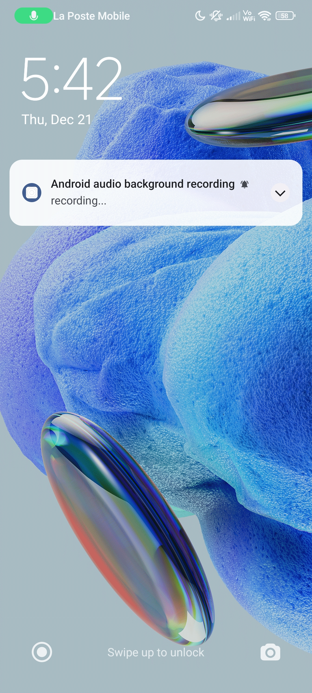

# Expo AV Android Recording In Background Muted After 1 Minute

Issue URL: https://github.com/expo/expo/issues/25977

## Fix

The technique here is to add a [Foreground Service](https://developer.android.com/develop/background-work/services/foreground-services) to prevent the app from being [dozed off](https://developer.android.com/training/monitoring-device-state/doze-standby) by Android.

In this POC, I'm using [Notifee](https://notifee.app/), but feel free to use whatever package suits you.

### Setup

- Install Notifee with `expo install @notifee/react-native`. ⚠️ at the time of this writting, Notifee's documentation website is at least 8 months being the [documentation on their Github](https://github.com/invertase/notifee/blob/main/docs-react-native/react-native/docs/overview.md). Check it out for the most up-to-date instructions!
- [Create a development build in Expo](https://docs.expo.dev/develop/development-builds/create-a-build/) with `eas build --profile development --platform android`.
- Run your custom Expo build with `npx expo start --dev-client`.

### How does it work?

1. Register the foreground service at your application's root, outside of any React components.

```
notifee.registerForegroundService(() => {
  return new Promise(() => {
    // Long running task...
  });
});
```

2. Start the foreground service by adding this code to a function inside your React component. In this POC, when the recording starts.

```
const channelId = await notifee.createChannel({
  id: "recording",
  name: "Recording",
});

notifee.displayNotification({
  title: "Android audio background recording",
  body: "recording...",
  android: {
    channelId,
    asForegroundService: true,
  },
});
```

3. Stop the foreground service when you don't need it anymore. In the POC, when the recording stops.

```
await notifee.stopForegroundService();
```



⚠️ The notification will not appear the first time you start recording after opening the application. But it will work fine afterwards.

## Miscellaneous

### Expo

- What is a development build?: https://docs.expo.dev/develop/development-builds/introduction/
- Create a development build: https://docs.expo.dev/develop/development-builds/create-a-build/

### Notifee

- Most up-to-date documentation: https://github.com/invertase/notifee/blob/main/docs-react-native/react-native/docs/overview.md
- Foreground Service: https://notifee.app/react-native/docs/android/foreground-service
