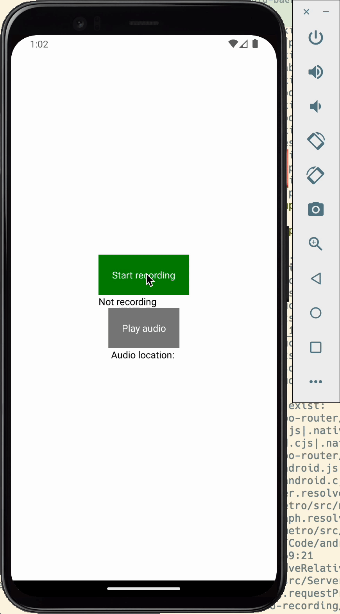
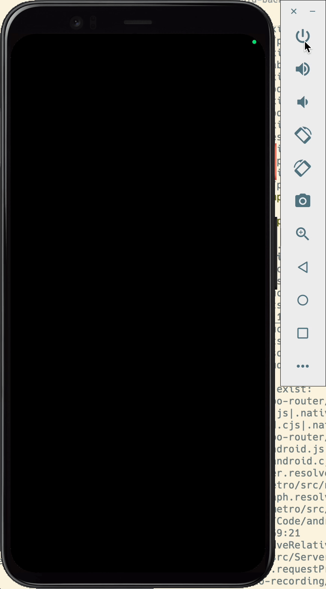

# Expo AV Android Recording In Background Muted After 1 Minute

Issue URL: https://github.com/expo/expo/issues/25977

Fix URL: https://github.com/RilDev/bug-expo-av-android-recording-in-background-muted-after-1-minute/tree/fix

## Expected behaviour

_The user uses an Android phone._

- The user clicks on the "Start recording" button to start the recording.
- The user locks his phone for more than a minute.
- The user unlocks his phone and clicks on "Stop recording" to stop the recording.

=> The user can listen to the whole recording from begining to end by clicking on the "Play audio" button.

## Actual behaviour

When the user user clicks on the "Play audio" button, the audio recorded between 1 minute after the phone has been locked and the moment the phone is unlocked is muted.



**Wait for at least 1 minute**



## Environment

```
expo-env-info 1.0.5 environment info:
    System:
      OS: macOS 13.4.1
      Shell: 5.9 - /bin/zsh
    Binaries:
      Node: 20.3.1 - ~/.nvm/versions/node/v20.3.1/bin/node
      Yarn: 1.22.19 - /opt/homebrew/bin/yarn
      npm: 9.6.7 - ~/.nvm/versions/node/v20.3.1/bin/npm
      Watchman: 2023.10.09.00 - /opt/homebrew/bin/watchman
    Managers:
      CocoaPods: 1.12.0 - /Users/rildev/.rvm/gems/ruby-3.0.0/bin/pod
    SDKs:
      iOS SDK:
        Platforms: DriverKit 22.4, iOS 16.4, macOS 13.3, tvOS 16.4, watchOS 9.4
      Android SDK:
        API Levels: 30, 33, 33
        Build Tools: 30.0.3, 33.0.0, 33.0.2, 34.0.0
        System Images: android-28 | Google ARM64-V8a Play ARM 64 v8a, android-33 | Google Play ARM 64 v8a, android-UpsideDownCake | Google APIs ARM 64 v8a, android-UpsideDownCake | Google Play ARM 64 v8a
    IDEs:
      Android Studio: 2022.1 AI-221.6008.13.2211.9619390
      Xcode: 14.3.1/14E300c - /usr/bin/xcodebuild
    npmPackages:
      expo: ~49.0.15 => 49.0.21
      react: 18.2.0 => 18.2.0
      react-native: 0.72.6 => 0.72.6
    npmGlobalPackages:
      eas-cli: 5.4.0
    Expo Workflow: managed
```
